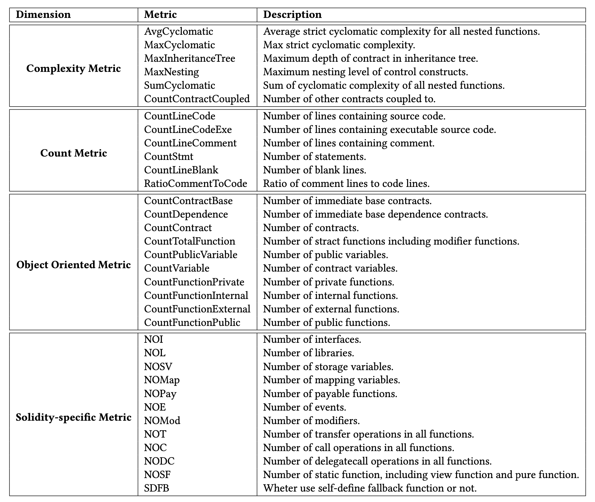
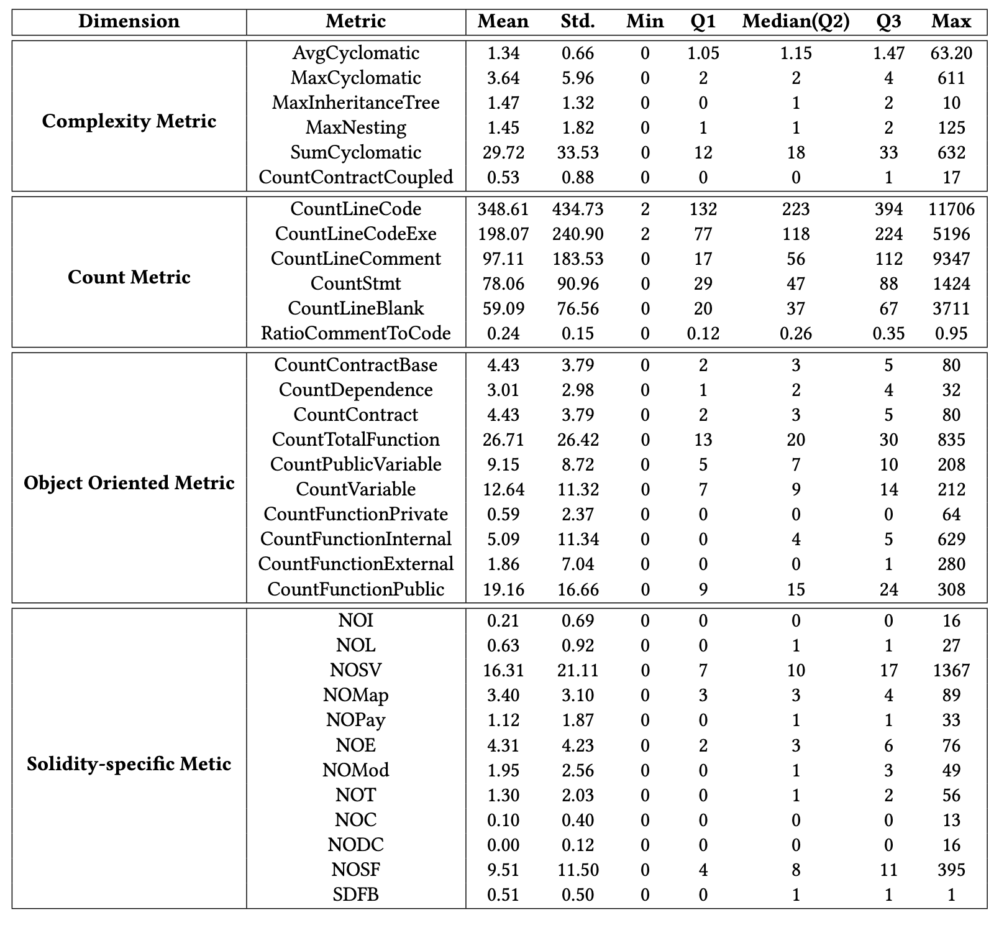

# Automatic Identification of Crash Smart Contracts

A repository for sharing the smart contract dataset collected from Ethereum by **July 31, 2019**.
We label these smart contract based on the execution status of transactions by **October 10, 2020**.

The labeled datas are stored in **DATA** folder in the form of csv.

# Structure

- Baselines
    source code of baselines
- CrashSCDet
    source code of our approach including the code to extract all metrics
- DATA
    extracted data and filtered data.

# Static Source Code Metrics

We totally define 34 static source code metrics and divide them into four dimensions: "complexity metrics", "count metrics", "object oriented metrics" and "solidity specific metrics". 
The following table shows the static source code metrics for smart contracts used in our paper.

# An introduction to the metrics proposed in our work:

# Descriptive statistics of the calculated metric values

